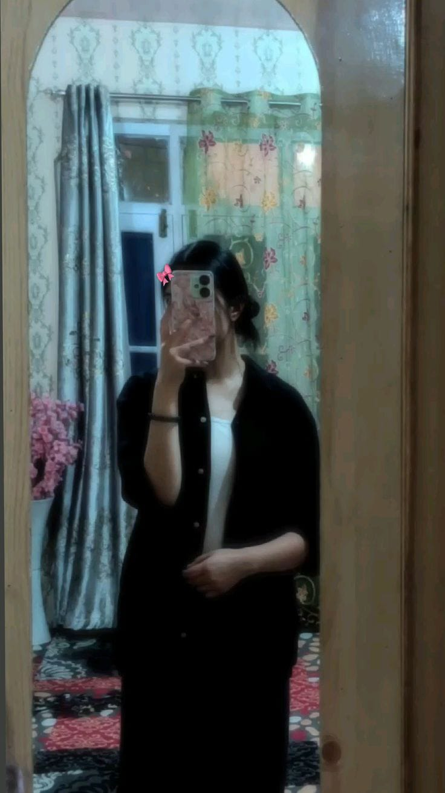

<!DOCTYPE html>
<html lang="ar">
<head>
<meta charset="UTF-8">
<meta name="viewport" content="width=device-width, initial-scale=1.0">
<title>❤️</title>

</head>

<body>

<!-- 🎬 Loading -->

جارِ التحميل… ❤️

<!-- 🔐 -->

المكان ده لينا بس 🤍

1

2

3

4

5

6

7

8

9

0

<!-- 💌 -->

<!-- 😏 -->

مش هتعدي غير لما تديني بوسة 😏

<button onclick="kiss()">امواااه 💋</button>
<button onclick="noKiss()">لا 😕</button>

<!-- 🎵 -->

دوسي هنا 🎧

<button onclick="playSong()">تشغيل</button>
<audio id="song" src="song.mp3"></audio>

<!-- 🖼️ -->

<!-- 📖 -->

بداية

<button onclick="nextPage()">اقلب الصفحة</button>

<!-- ⏳ -->

<button onclick="love()">بتحبني قد اي</button>

</body>
</html>
